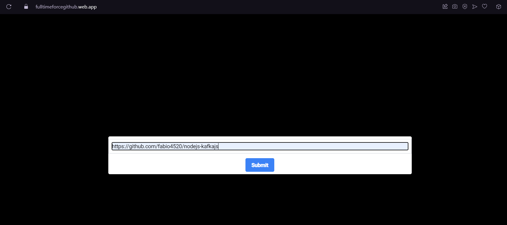
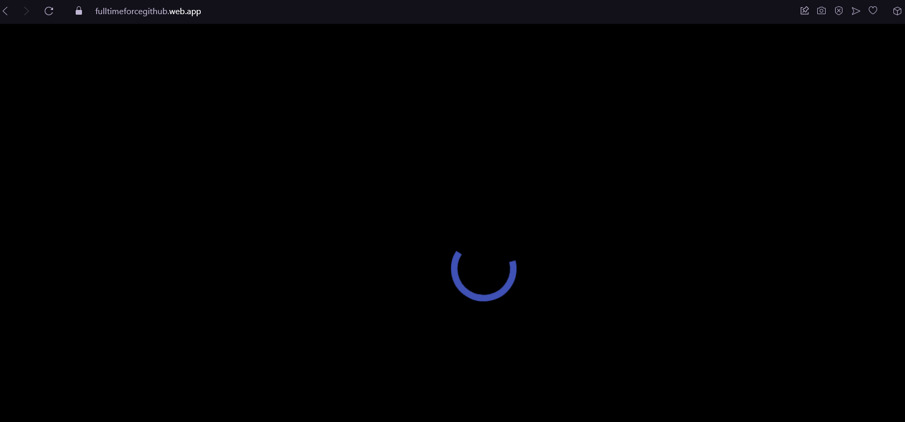
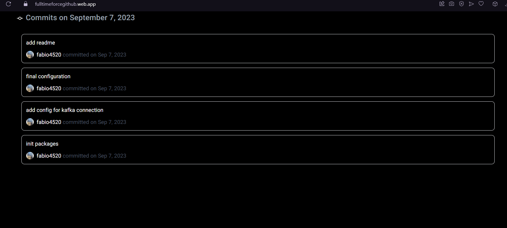
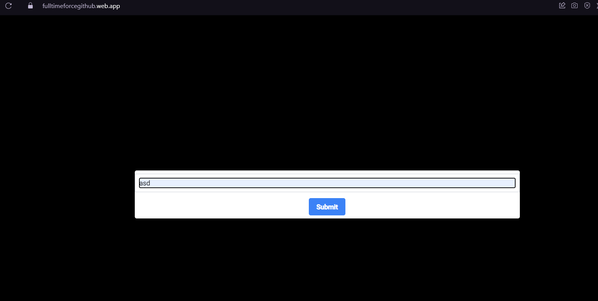
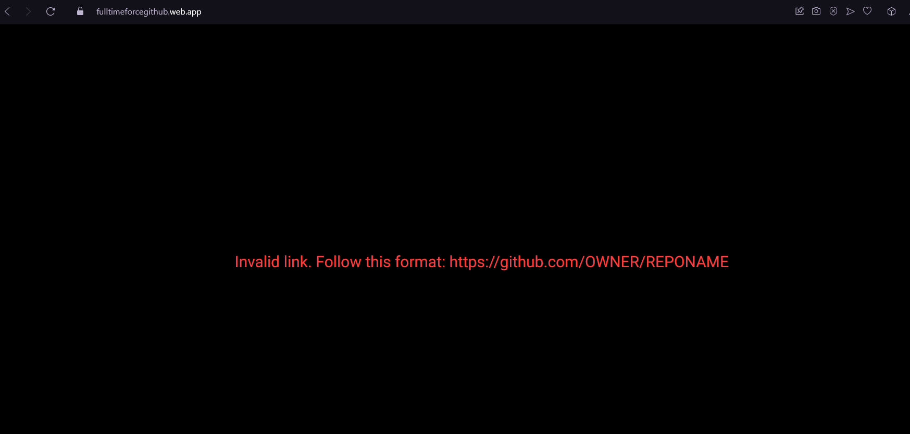

# FullTimeForce App

This is a Dockerized Angular application that uses Nginx to serve the static files of the app.

## Getting Started

Follow these instructions to get the project up and running in your local development environment.

This app has been deployed and you can find it in the following link

### Prerequisites

Before you begin, make sure you have the following software installed on your machine:

- [Docker](https://www.docker.com/get-started)

### Installation

1. Clone the repository to your local machine:

   ```bash
   git clone https://github.com/fabio4520/fulltimeforce-github-app.git
   cd fulltimeforce-github-app
   ```

2. Build the Docker image for the Angular app:

   ```bash
   docker build -t fulltimeforceapp .
   ```

### Running the App

Once the Docker image is built, you can run a Docker container to start the Angular app.

```bash
docker run -d -p 8080:80 fulltimeforceapp
```

This command maps port 8080 on your host machine to port 80 inside the Docker container. Adjust the port numbers as needed.

### Accessing the App

You can now access the Angular app in your web browser by navigating to [http://localhost:8080](http://localhost:8080). If you mapped a different port, use that port number instead.

# Images





