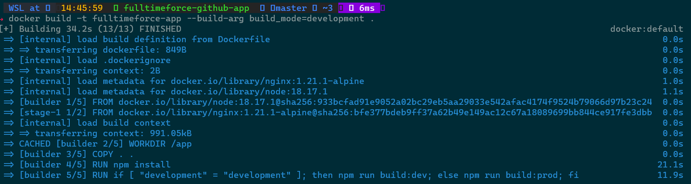
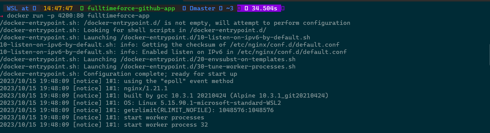
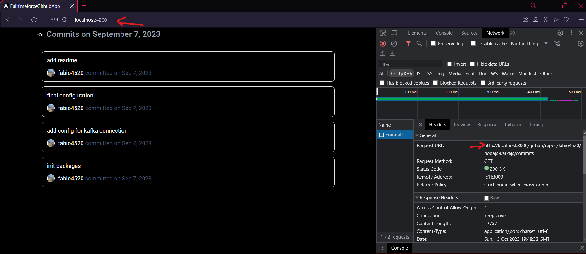
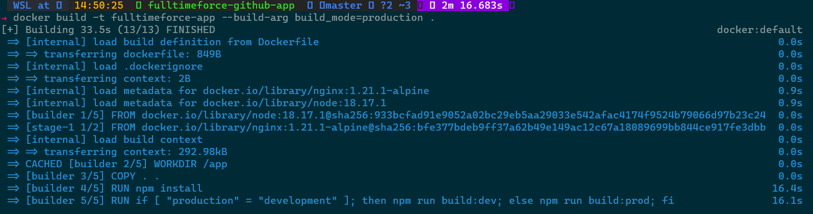
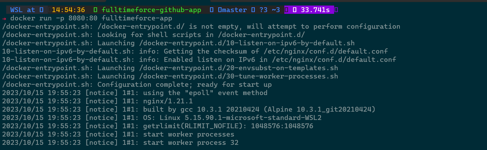
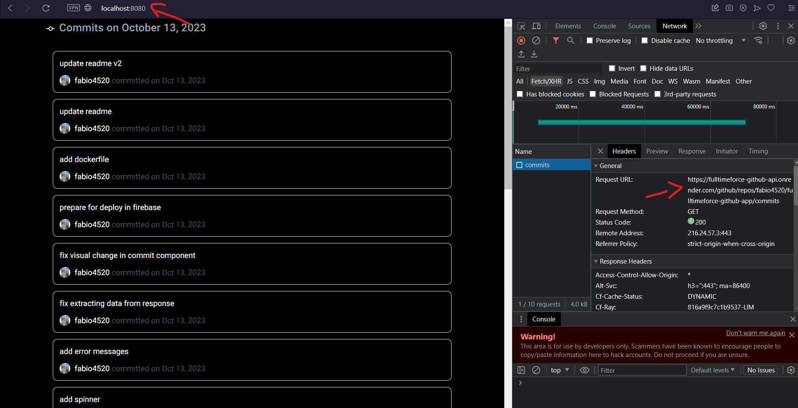

# FullTimeForce App

This is a Dockerized Angular application that uses Nginx to serve the static files of the app.

## Getting Started

Follow these instructions to get the project up and running in your local development environment.

This app has been deployed and you can find it in the following link https://fulltimeforcegithub.web.app

### Prerequisites

Before you begin, make sure you have the following software installed on your machine:

- [Docker](https://www.docker.com/get-started)

### Installation

1. Clone the repository to your local machine:

   ```bash
   git clone https://github.com/fabio4520/fulltimeforce-github-app.git
   cd fulltimeforce-github-app
   ```

2. There are two ways for building the image and execute the container. It will dependend if you want to start in dev mode or in prod mode. 
The difference is that when you start in dev mode, you need to run the api repository, so the frontend can comunicate with the backend in your local machine.
In prod mode the front will use the url of the backend that is deployed in live preview.

 Development mode

   ```bash
   docker build -t fulltimeforceapp --build-arg build_mode=development .
   docker run -p 4200:80 fulltimeforceapp
   ```

Production mode

   ```bash
   docker build -t fulltimeforceapp --build-arg build_mode=production .
   docker run -p 8080:80 fulltimeforceapp
   ```

These command maps port you declare on your command line. Adjust the port numbers as needed.

### Accessing the App

You can now access the Angular app in your web browser by navigating to [http://localhost:8080](http://localhost:8080) (in prod mode) or [http://localhost:4200](http://localhost:4200) (in dev mode). If you mapped a different port, use that port number instead.

# Images


## Dev mode using docker




## Prod mod using docker


